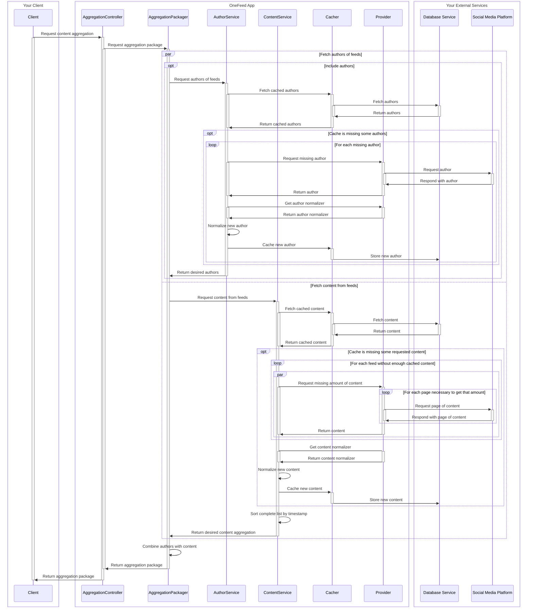

# Current End-to-End Aggregation Retrieval Sequence (To Be Revised)
This was/is the original, planned sequence of events that occurs when a user requests an aggregation 
from OneFeed's API. **It is set for revision soon** to reduce latency when Providers must be called, 
likely by responding with cached data immediately and streaming the rest of the data from the 
Providers as it comes in.
