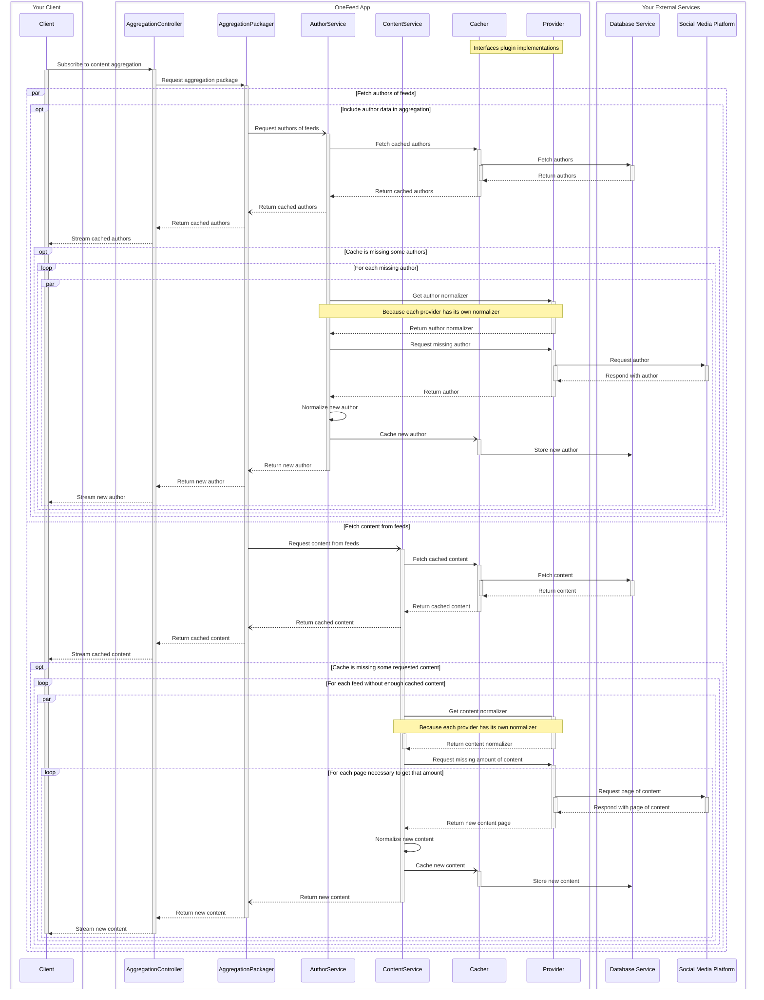

# End-to-End Aggregation Retrieval Sequence
This is the current, planned sequence of events that occurs when a user requests an aggregation 
from OneFeed's API.

```mermaid
sequenceDiagram
    box Your Client
        participant Client
    end
    box OneFeed App
        participant AggregationController
        participant AggregationPackager
        participant AuthorService
        participant ContentService
        participant Cacher
        participant Provider
    end
    box Your External Services
        participant Database Service
        participant Social Media Platform
    end
    Note over Provider,Cacher: Interfaces plugin implementations

    Client->>+AggregationController: Subscribe to content aggregation
    activate Client
    AggregationController->>+AggregationPackager: Request aggregation package
    par Fetch authors of feeds
        opt Include author data in aggregation
            AggregationPackager-)+AuthorService: Request authors of feeds
            
            AuthorService->>+Cacher: Fetch cached authors
            Cacher->>+Database Service: Fetch authors
            activate Cacher
                Database Service-->>-Cacher: Return authors
            deactivate Cacher
            Cacher-->>-AuthorService: Return cached authors
            AuthorService--)AggregationPackager: Return cached authors
            AggregationPackager-->>AggregationController: Return cached authors
            AggregationController-->>Client: Stream cached authors
            
            opt Cache is missing some authors
                loop For each missing author
                    par
                        AuthorService->>+Provider: Get author normalizer
                        Note over AuthorService,Provider: Because each provider has its own normalizer
                        Provider-->>-AuthorService: Return author normalizer
                        
                        AuthorService->>+Provider: Request missing author
                        Provider->>+Social Media Platform: Request author
                        activate Provider
                            Social Media Platform-->>-Provider: Respond with author
                        deactivate Provider
                        Provider-->>-AuthorService: Return author
                        
                        AuthorService->>AuthorService: Normalize new author
                        
                        AuthorService-)+Cacher: Cache new author
                        Cacher->>-Database Service: Store new author
                        
                        AuthorService--)-AggregationPackager: Return new author
                        AggregationPackager-->>AggregationController: Return new author
                        AggregationController-->>Client: Stream new author
                    end
                end
            end
        end
    and Fetch content from feeds
        AggregationPackager-)+ContentService: Request content from feeds
        
        ContentService->>+Cacher: Fetch cached content
        Cacher->>+Database Service: Fetch content
        activate Cacher
            Database Service-->>-Cacher: Return content
        deactivate Cacher
        Cacher-->>-ContentService: Return cached content
        ContentService--)AggregationPackager: Return cached content
        AggregationPackager-->>AggregationController: Return cached content
        AggregationController-->>Client: Stream cached content
        
        opt Cache is missing some requested content
            loop For each feed without enough cached content
                par
                    ContentService->+Provider: Get content normalizer
                    Note over ContentService,Provider: Because each provider has its own normalizer
                    activate ContentService
                    Provider-->>-ContentService: Return content normalizer
                    deactivate ContentService
                    
                    ContentService->>+Provider: Request missing amount of content
                    loop For each page necessary to get that amount
                        Provider->>+Social Media Platform: Request page of content
                        activate Provider
                            Social Media Platform-->>-Provider: Respond with page of content
                        deactivate Provider
                        Provider-->>-ContentService: Return new content page
                        
                        ContentService->>ContentService: Normalize new content
                        
                        ContentService-)+Cacher: Cache new content
                        Cacher->>-Database Service: Store new content
                        
                        ContentService--)-AggregationPackager: Return new content
                        AggregationPackager-->>-AggregationController: Return new content
                        AggregationController-->>-Client: Stream new content
                        deactivate Client
                    end
                end
            end
        end
    end
```